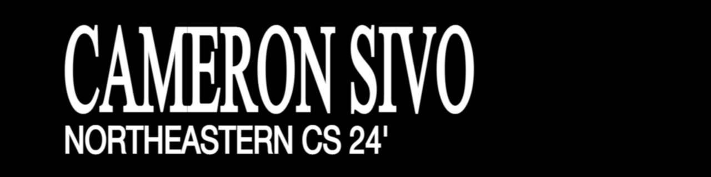

### Hi! 👋

I'm Cameron, a 4th year Computer Science student at Northeastern University with a concentration in Software.

##### CURRENTLY WORKING ON

- 📻 Software Development for [WRBB 104.9 FM](https://wrbbradio.org/) (Northeastern's Radio Broadcast Center)
- ✨ Learning React through various resources and projects

##### ABOUT ME
- 😄 Pronouns: he/him
- 💬 Something That Interests Me: The intersection of Computer Science and Music. As both a programmer and jazz musician, I love seeing how the two worlds interact with each other.
- ⚡ Fun fact: I'm a triplet!
- 📫 How to reach me: 
  - 📧 <sivo.c@northeastern.edu>
  - 💡 [LinkedIn](https://www.linkedin.com/in/cameron-sivo-68a721224/)
